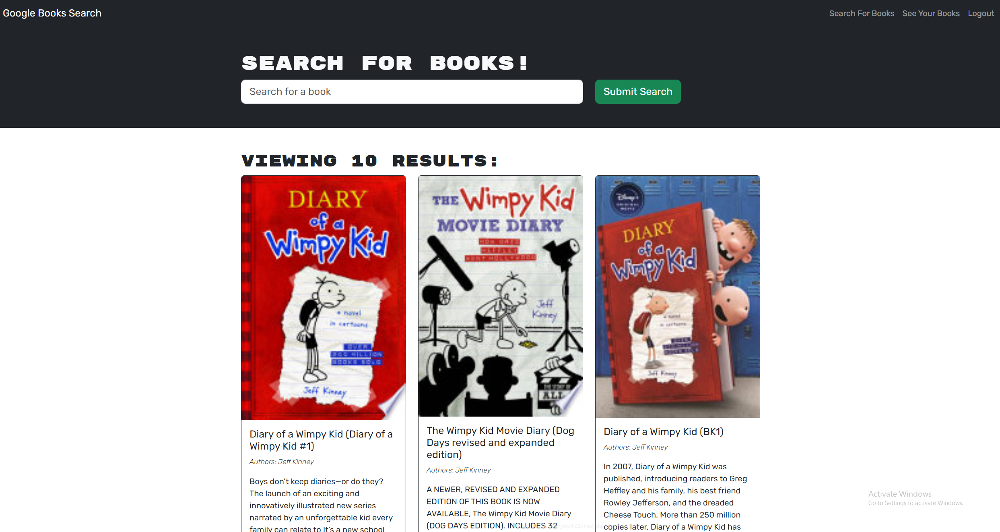

# Book Search Engine
    
## Description
    
Browse through a large selection of books and saved them to your list for later viewing.

## Screenshot

## Deployed Application

https://book-search-engine-dbtt.onrender.com
    
## Table of Contents
    
- [Installation](#installation)
- [Usage](#usage)
- [License](#license)
- [How to Contribute](#contributing)
- [Test](#test)
- [Questions](#questions)
    
## Installation
    
N/A
    
## Usage
    
Once in the site, either signup for first time users, or login if you're returning. Once thats done, you can perform a search on the homepage for any book you'd like. A list will appear. When you find the one you want, click on the 'add book' button and it will be added to your list. To view the list, click view saved books.
    
## License
    
MIT License
    
## Contributing
    
N/A
    
## Test
    
N/A
    
## Questions
    
My Github account is [GitHub.com/midasantiago](github.com/midasantiago)
    
If you wish to contact me you can do so at mida.santiago98@gmail.com
    
